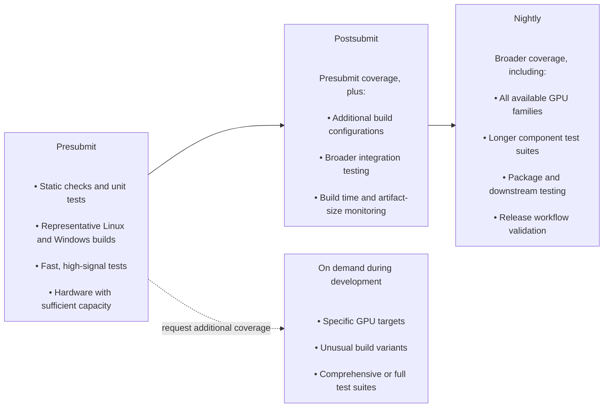
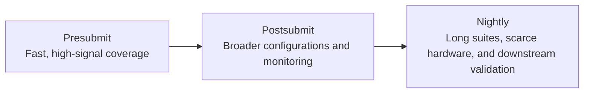

# Testing overview

**TheRock is the integration point for all build, test, packaging, and release
infrastructure for ROCm Core.** The code here is used by developers building
ROCm from source, CI systems validating pull request contributions
in repositories like [rocm-systems](https://github.com/ROCm/rocm-systems) and
[rocm-libraries](https://github.com/ROCm/rocm-libraries), and release workflows
publishing nightly and stable releases in
[rockrel](https://github.com/ROCm/rockrel) which are trusted by users and
downstream projects.

**TheRock aims to keep ROCm "ready to release" at any time.** Achieving this at
scale requires robust automated tests that detect issues as close as possible
to their source. Early detection limits the impact of regressions and makes
them easier to diagnose and fix, while continuous validation provides the
confidence needed to release frequently.

**Testing must scale across a broad support surface.** ROCm includes
40+ subprojects, supports 25+ GPU targets across multiple hardware generations,
runs on multiple operating systems, is distributed via multiple packaging
formats, and is used by many downstream frameworks. Testing every combination
for every change is not practical, so TheRock layers automated tests according
to their cost and the confidence they provide. Presubmit testing prioritizes
fast, high-signal test suites and configurations with enough capacity to run for
every change. Longer test suites and hardware with limited runner capacity are
exercised through nightly, scheduled, and on-demand testing.

**Testing should be accessible to all contributors.** Wherever possible,
code and automation should be structured so that important behavior can be
tested quickly on commonly available development machines. Local testing usually
provides the fastest feedback, while continuous integration (CI) workflows
provide consistent environments for validating changes across representative
project-wide configurations and component boundaries.

**ROCm Core is built and released as a single product.** Individual subprojects
can validate their own behavior in isolation, but TheRock assembles and tests
those projects together as often as practical throughout development, providing
confidence in cross-component behavior and product-wide properties that
component-level testing cannot evaluate.

<!-- TODO: make this content flow better, "good testing" is too vague -->

This page describes how these testing layers work together, how TheRock code
can make good testing the easy path, and what good testing looks like for
common types of contributions.

## Testing principles

### Make tests accessible during development

### Use layered validation

- Use static analysis for mechanical checks

### Scale coverage to available resources

<!-- DRAFT diagrams -->





### Add reliable tests to required CI

______________________________________________________________________

## Testing changes to TheRock

### Test categories in TheRock

Tests for the code in TheRock itself are split into a few broad categories:

- pre-commit and static checks
  - These are fast checks for formatting, linting, repository policies, and more
  - Example checks (see [`.pre-commit-config.yaml`](/.pre-commit-config.yaml)):
    - `actionlint` for GitHub Actions workflow files
    - `black` formatting for Python scripts
- unit tests
  - These are tests for script behavior, runnable on generic hardware
  - Example tests:
    - [`build_tools/tests/build_topology_test.py`](/build_tools/tests/build_topology_test.py)
    - [`build_tools/tests/py_packaging_test.py`](/build_tools/tests/py_packaging_test.py)
    - [`build_tools/github_actions/tests/workflow_dispatch_inputs_test.py`](/build_tools/github_actions/tests/workflow_dispatch_inputs_test.py)
- integration tests
  - These provide validation for build outputs and packages and may run on real hardware
  - Example tests:
    - [`tests/test_artifact_structure.py`](/tests/test_artifact_structure.py)
    - [`tests/test_rocm_sanity.py`](/tests/test_rocm_sanity.py)
    - [`build_tools/packaging/linux/native_linux_package_install_test.py`](/build_tools/packaging/linux/native_linux_package_install_test.py)
    - [`build_tools/packaging/python/templates/rocm/src/rocm_sdk/tests/core_test.py`](/build_tools/packaging/python/templates/rocm/src/rocm_sdk/tests/core_test.py)

Tests in each category are runnable as part of local development and are also
run as part of our CI workflows:

| Test type         | Target test runtime               | CI workflows                                                                                                                                                                                                                                                                                                                                      |
| ----------------- | --------------------------------- | ------------------------------------------------------------------------------------------------------------------------------------------------------------------------------------------------------------------------------------------------------------------------------------------------------------------------------------------------- |
| pre-commit        | 10 seconds                        | <ul><li>[`.github/workflows/pre-commit.yml`](/.github/workflows/pre-commit.yml)</li></ul>                                                                                                                                                                                                                                                         |
| unit tests        | 5 minutes (independent of builds) | <ul><li>[`.github/workflows/unit_tests.yml`](/.github/workflows/unit_tests.yml)</li></ul>                                                                                                                                                                                                                                                         |
| integration tests | 30 minutes (after builds)         | <ul><li>[`.github/workflows/test_artifacts_structure.yml`](/.github/workflows/test_artifacts_structure.yml)</li><li>[`.github/workflows/test_native_linux_packages_install.yml`](/.github/workflows/test_native_linux_packages_install.yml)</li><li>[`.github/workflows/test_rocm_wheels.yml`](/.github/workflows/test_rocm_wheels.yml)</li></ul> |

Project features should be tested using a combination of these test types
that balance time to signal and representative coverage. For example, Python
packages should have both unit tests for package building and integration tests
for package installation and runtime behavior.

<!-- TODO: add subsections to each feature area:

#### Scope
#### Design for testing
#### Validation methods
#### Limitations and known gaps

 -->

### TheRock feature area: CMake and super-project build logic

As the centralized build system for ROCm Core, TheRock includes a CMake
super-project using code in:

- CMake files like [`CMakeLists.txt`](/CMakeLists.txt),
  [`cmake/therock_amdgpu_targets.cmake`](/cmake/therock_amdgpu_targets.cmake),
  and [`FLAGS.cmake`](/FLAGS.cmake)
- Topology metadata in [`BUILD_TOPOLOGY.toml`](/BUILD_TOPOLOGY.toml)
- Sub-project declarations like [`math-libs/CMakeLists.txt`](/math-libs/CMakeLists.txt)
- Sub-project artifact descriptors like [`math-libs/BLAS/artifact-blas.toml`](/math-libs/BLAS/artifact-blas.toml)
- Scripts used by the build system like [`build_tools/fileset_tool.py`](/build_tools/fileset_tool.py)

The build system supports a broad matrix of configurations:

| Matrix dimension          | Available configurations                                                                        | Typical CI coverage                             |
| ------------------------- | ----------------------------------------------------------------------------------------------- | ----------------------------------------------- |
| Operating system          | Linux (multiple distros), WSL, Windows                                                          | Linux (manylinux), WSL, Windows                 |
| Build variant             | Release, Debug, Address Sanitizer (ASan), etc.                                                  | Release, ASan                                   |
| AMDGPU build/test targets | `gfx942`, `gfx950`, `gfx1100`, `gfx1200`, etc.                                                  | 1-5 targets (based on test runner availability) |
| Enabled subprojects       | `THEROCK_ENABLE_ALL`, `THEROCK_ENABLE_PROFILER`, etc.                                           | All enabled, subsets as an optimization         |
| Enabled feature flags     | See [`FLAGS.cmake`](/FLAGS.cmake) and [`docs/development/flags.md`](/docs/development/flags.md) | Default values                                  |
| Other CMake options       | `THEROCK_BUILD_TESTING`, `THEROCK_BUNDLE_SYSDEPS`, etc.                                         | Default values                                  |

The CI systems in [TheRock](https://github.com/ROCm/TheRock) and component
repositories like [rocm-systems](https://github.com/ROCm/rocm-systems)
continuously build a few slices through this support matrix. For changes
to build system files, we generally look for

- The build and test jobs in
  [`.github/workflows/multi_arch_ci.yml`](/.github/workflows/multi_arch_ci.yml)
  should not have new failures.
- The build jobs should not significantly regress in duration.
  - _We currently only monitor for this after merge, we'd like to watch these metrics more proactively in the future_
- The build artifacts should not unexpectedly grow in size.
  - _We currently only monitor for this after merge, we'd like to watch these metrics more proactively in the future_

> [!IMPORTANT]
> Certain types of changes may warrant additional validation, such as:
>
> - Adding new subprojects
> - Adjusting support for specific AMDGPU targets
> - Updates to the compiler (llvm-project)
>
> Pull requests that modify key git submodules in TheRock automatically run
> extra CI jobs. These extra CI jobs can be enabled for other PRs through
> the mechanisms documented in
> [ci_behavior_manipulation.md](/docs/development/ci_behavior_manipulation.md).

> [!TIP]
> As a general reference, here are some metrics for different CI jobs as of
> July 2026:
>
> | Job description                                                                                                    | Wall time | Build runner usage | Test runner usage |
> | ------------------------------------------------------------------------------------------------------------------ | --------- | ------------------ | ----------------- |
> | rocm-systems per-commit CI<br><ul><li>Linux, Windows</li><li>2 GPU families</li><li>"standard" test type</li></ul> | 3 hours   | 4 hours            | 2 hours           |
> | TheRock per-commit CI<br><ul><li>Linux, Windows</li><li>5 GPU families</li><li>"quick" test type</li></ul>         | 4 hours   | 12 hours           | 10 hours          |
> | Nightly releases<br><ul><li>Linux, Windows</li><li>15+ GPU families</li><li>"comprehensive" test type</li></ul>    | 6 hours   | 40+ hours          | 100+ hours        |
>
> Our target is 30 minutes "time to signal" wall time including builds and tests.

### TheRock feature area: GitHub Actions workflows

We use [GitHub Actions](https://github.com/features/actions) in the
[`.github/workflows`](/.github/workflows/) directory for a variety of workflows:

- Lightweight checks: codeql.yml, gitleaks.yml, pre-commit.yml, unit_tests.yml, therock-pr-bot.yml, etc.
- CI/CD workflows: multi_arch_ci.yml, multi_arch_release.yml, etc.
- Other automation: bump_submodules.yml, copy_release.yml, publish_build_manylinux_x86_64.yml

Many of these workflows are central to day to day project development and
official releases, so care must be taken to test them thoroughly.

We test our GitHub Actions workflows using a combination of these practices:

- Run workflows through [actionlint](https://github.com/rhysd/actionlint)
  static analysis (this is required via a pre-commit hook)
- Add unit tests like
  [`build_tools/github_actions/tests/workflow_dispatch_inputs_test.py`](/build_tools/github_actions/tests/workflow_dispatch_inputs_test.py)
  where actionlint falls short
- Keep workflows as simple as possible, e.g. by putting logic in
  Python scripts rather than inline Bash and then writing unit tests for those
  scripts (see [this section in `github_actions_style_guide.md`](/docs/development/style_guides/github_actions_style_guide.md#prefer-python-scripts-over-inline-bash))
- Test changes to workflows using "CI" and "dev" environments isolated from
  production (see
  ["Testing release workflows" in `github_actions_debugging.md`](/docs/development/github_actions_debugging.md#testing-release-workflows)
  and [`s3_buckets.md`](/docs/development/s3_buckets.md))
- Configure workflows to support limited testing configurations (e.g. one Python version for testing, full `3.11,3.12,3.13,3.14` for releases) <!-- TODO: wordsmith here-->
- Where possible, support testing workflows in repository forks (see
  ["Working effectively from forks" in `github_actions_debugging.md`](/docs/development/github_actions_debugging.md#working-effectively-from-forks))
- When workflows and scripts are used across repositories, pin to specific commits
  - In https://github.com/ROCm/rocm-libraries and
    https://github.com/ROCm/rocm-systems, "TheRock CI" uses commit pins that
    receive regular update pull requests via
    [`build_tools/github_actions/bump_automation.py`](/build_tools/github_actions/bump_automation.py).
    These pull requests can be reviewed and fixed when there are breaking
    changes to the build system, workflows, or scripts.

  - In https://github.com/ROCm/rockrel (our dedicated releases repository with
    tighter access controls) we use unpinned references so nightly releases
    always use the latest code:

    ```yml
    uses: ROCm/TheRock/.github/workflows/multi_arch_release.yml@main
    ```

    This has been a frequent source of breaks where workflow inputs differ
    across repositories if parity commits are not merged together. See
    https://github.com/ROCm/rockrel/issues/49 for ideas to improve that.

<!-- TODO: flowchart for how to test workflow changes

run scripts locally
use scripts in workflows
trigger test runs prior to merge
monitor test runs after merge (downstream, nightly jobs, etc.)
  -->

### TheRock feature area: Python scripts and tools

We test our Python scripts using [pytest](https://docs.pytest.org/), aiming to
follow the style guidelines in
[`python_style_guide.md`](/docs/development/style_guides/python_style_guide.md)
and particularly the
["testing standards" section](/docs/development/style_guides/python_style_guide.md#testing-standards).

All Python unit tests should be run as part of
[`.github/workflows/unit_tests.yml`](/.github/workflows/unit_tests.yml), with
the help of files like
[`build_tools/pyproject.toml`](/build_tools/pyproject.toml). Some tests have
been added without including them on CI, which is getting fixed via
https://github.com/ROCm/TheRock/issues/6927.

Good unit test design is part science and part art. Where our style guide
is not specific, we encourage learning from and referencing content such as
https://testing.googleblog.com/, including:

- [Blog 2024-05: Test Failures Should Be Actionable](https://testing.googleblog.com/2024/05/test-failures-should-be-actionable.html)
- [Blog 2024-04: Prefer Narrow Assertions in Unit Tests](https://testing.googleblog.com/2024/04/prefer-narrow-assertions-in-unit-tests.html)
- [Blog 2024-02: Increase Test Fidelity By Avoiding Mocks](https://testing.googleblog.com/2024/02/increase-test-fidelity-by-avoiding-mocks.html)
- [Blog 2017-12: Only Verify State-Changing Method Calls](https://testing.googleblog.com/2018/06/testing-on-toilet-only-verify-relevant.html)
- [Blog 2018-06: Only Verify Relevant Method Arguments](https://testing.googleblog.com/2017/12/testing-on-toilet-only-verify-state.html)
- [Blog 2015-01: Change-Detector Tests Considered Harmful](https://testing.googleblog.com/2015/01/testing-on-toilet-change-detector-tests.html)
- [Blog 2014-07: Don't Put Logic in Tests](https://testing.googleblog.com/2014/07/testing-on-toilet-dont-put-logic-in.html)

### TheRock feature area: Packaging

<!-- TODO: "infrastrcture" is overloaded here -->

<!-- TODO: merge with "Validating assembled ROCm" section below?

     could focus this on release workflows?
-->

<!-- DRAFT -->

Types of packages:

- artifacts (the raw build system outputs)
- tarballs/archives (folder distributions that are not associated with any particular package manager / ecosystem)
- native linux packages (deb/rpm)
- native windows packages (msi)
- python packages

Test for:

- unit test: package construction (no crashes, outputs are not malformed, files are filtered as expected)
- integration test: package install/usage behavior
  - installable
  - can load and call APIs - matching what user-facing instructions say to do
  - install on multiple supported distros (e.g. build on manylinux -> test on Ubuntu and RHEL)
- integration test: interaction between multiple packages
  - ROCm packages should be self-sufficient and not conflict with system packages
  - packages should be compatible/usable with other packages in the same ecosystem (e.g. PyTorch using ROCm python packages)

<!-- DRAFT -->

### TheRock feature area: CI infrastructure

<!-- TODO: "infrastrcture" is overloaded here -->

### TheRock feature area: Framework integration tooling

______________________________________________________________________

## Testing changes to ROCm subprojects with TheRock

<!-- TODO: mention therock_cmake_subproject_build_test -->

<!-- TODO: mention build_tools/github_actions/test_executable_scripts/README.md -->

### Build subprojects through TheRock

### Use standardized component test interfaces

- build_tools/github_actions/test_executable_scripts/test_runner.py

### Make test environments explicit and reproducible

<!-- TODO: reword section header, merge with prior section? -->

- tests should aim to be runnable from installed artifacts using standard test runners, e.g. `pytest` or `ctest`
  - avoid what build_tools/github_actions/test_executable_scripts/test_hiptests.py does with copy_dlls_exe_path
  - avoid that build_tools/github_actions/test_executable_scripts/test_origami.py does with `LD_LIBRARY_PATH`
  - goal: download/extract rocm artifacts, call test script with no environment variables, observe no side effects in the install itself (external temp directories are fine)
- developers _working on the projects_ and users/CI systems that _install test artifacts_ should have the same experience

### "TheRock CI" in component repositories

<!-- DRAFT -->

- First CI line of defense against regressions

<!-- DRAFT -->

### Test submodule updates

#### Testing changes to rocm-libraries and rocm-systems

#### Testing changes to llvm-project

______________________________________________________________________

## Validating assembled ROCm

### Validate artifact contents and dependencies

### Install and test distributed packages

### Run component tests against assembled ROCm

### Test on supported GPU hardware

### Validate downstream frameworks

### Validate development and release pipelines
